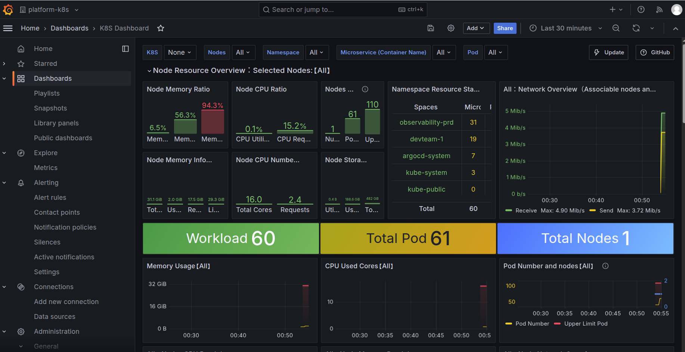

# 🔭 Local Observability Stack (LGTM + MinIO + Alloy)

A production-ready, multi-tenant observability platform running locally on **K3s**. It uses **Terraform** for Infrastructure-as-Code and **ArgoCD** for GitOps deployment.



## 🏗 Architecture

| Component | Role | Details |
| :--- | :--- | :--- |
| **K3s** | Cluster | Lightweight Kubernetes distribution. |
| **ArgoCD** | GitOps | Manages all application deployments. |
| **MinIO** | Storage | S3-compatible backend for Mimir, Loki, and Tempo. |
| **Mimir** | Metrics | Multi-tenant Prometheus-compatible storage (Distributed). |
| **Loki** | Logs | Multi-tenant Log aggregation (SimpleScalable Mode). |
| **Tempo** | Traces | Multi-tenant Distributed Tracing (Monolithic). |
| **Alloy** | Collector | Split architecture: Node (DaemonSet) + Cluster (Deployment) + App Gateway (OTLP). |
| **Grafana** | Visuals | Multi-org setup with automated datasource provisioning & Federation. |

---

## 🚀 Quick Start

### 1. Prerequisites
* Linux/WSL2
* `make`, `curl`, `kubectl`
* `terraform`, `python3`

### 2. Installation
Run the master command to provision the cluster, install storage, and deploy the full stack:

```bash
make all
```

**What happens?**
1.  Installs **K3s**.
2.  Deploys **ArgoCD**.
3.  Provisions **MinIO** (S3) & generates credentials.
4.  Deploys **Mimir, Loki, Tempo** (configured for S3 & Multi-tenancy).
5.  Deploys **Grafana Alloy** (Node, Cluster, and App Gateway).
6.  Deploys **Grafana**.
7.  **Bootstraps Multi-tenancy:** Runs `scripts/manage.py` to create Organizations and Datasources automatically.

---

## 🔐 Multi-Tenancy & Access

This stack enforces strict multi-tenancy at the storage layer but allows **Federated Views** at the query layer (Dynatrace-style management zones).

### Organizations
| Org Name | Tenant ID | Description |
| :--- | :--- | :--- |
| **Main Org** | `anonymous` | Admin view. |
| **platform-k8s** | `platform-k8s` | K8s System metrics (Nodes, Kubelet) & Pod logs. |
| **platform-obs** | `platform-obs` | Internal monitoring of the Observability stack itself. |
| **devteam-1** | `devteam-1` | Application data (Traces/Metrics) from the Demo Shop. |

### Routing Logic (Alloy)
* **Alloy Node:** Scrapes Host metrics & Kubelet -> tags as `platform-k8s`.
* **Alloy Cluster:** Scrapes K8s Events, Kube State Metrics -> tags as `platform-k8s`.
* **Alloy App Gateway:** Receives OTLP data -> tags as `devteam-1` (or other app tenants).

### Federated Access (Management Zones)
The `devteam-1` and `platform-obs` organizations are configured with **Federated Datasources**.
* **Header:** `X-Scope-OrgID: devteam-1|platform-k8s`
* **Effect:** When a developer logs in, they see their application data **AND** the underlying infrastructure metrics (CPU/Memory of nodes) in a single view, without switching organizations.

---

## 🛠️ Usage & Utilities

### 📊 Access Dashboards
We provide a "Fancy" master script to manage access:

```bash
make forward
# OR
./scripts/portforward-all.sh start
```

| Service | Local URL | User | Password |
| :--- | :--- | :--- | :--- |
| **Grafana** | http://localhost:3000 | `admin` | *(Auto-fetched)* |
| **ArgoCD** | http://localhost:8081 | `admin` | *(Auto-fetched)* |
| **MinIO** | http://localhost:9001 | `admin` | *(Auto-fetched)* |
| **Shop App**| http://localhost:8080 | - | - |

### 🔄 Admin Tasks

**Bootstrap Organizations / Reset Tokens:**
If you need to regenerate Service Accounts or Datasources:
```bash
make bootstrap
```
*Results saved to `bootstrap-results.json`.*

**Clean Re-install of specific component:**
```bash
make uninstall-loki
make install-loki
```

**Uninstall Alloy:**
```bash
make uninstall-alloy-node
make uninstall-alloy-cluster
make uninstall-alloy-app-gateway
```

---

## 📁 Directory Structure

```text
.
├── k8s/
│   └── values/              # Helm Chart Values (Mimir, Loki, Tempo, Alloy, etc.)
├── scripts/
│   ├── manage.py            # Python script for Grafana API automation & Federation
│   ├── portforward-*.sh     # Auto-healing access scripts
│   └── setup-virtual-disk.sh
├── terraform/
│   └── main.tf              # Complete Infrastructure definition
├── Makefile                 # Master control plane
└── README.md
```

---

## 🧨 Nuclear Option

To completely wipe the cluster and start fresh:

```bash
make nuke
```